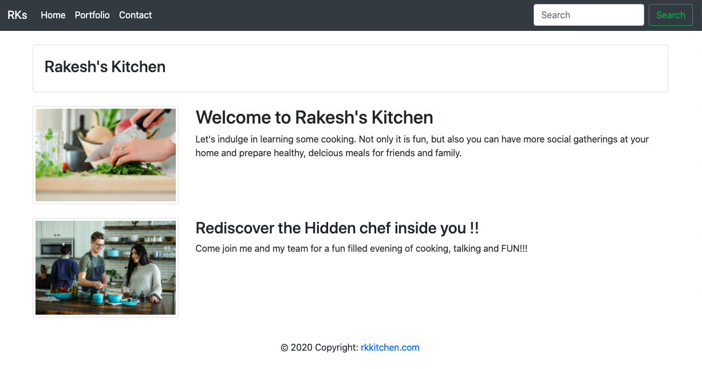

# Portfolio Website using Bootstrap Freameowrk

## Project Description

Main Objective of the project was to construct 3 page responsive website using Bootstrap faramework. Some of the addition requirements for successful completion of project was to 
    -   Use Semantic html
    -   validate html code to make sure html is valid

## Tasks Completed

Following tasks were completed as per requirements and screenshot of main page included

    -   Built all required pages using Bootstap framework
    -   Used semantic html elements
    -   Used appropriate header, navbar and footer components

Screenshot - 

## Validation

Verified all links are working and pages are responsvive depending on varied screen sizes, verified use of semantic html elements and valid html

## Observations and Learning opportunity

This excercise provided a great learning opportunity to build a multipage site using bootstrap framework from scratch. It was my first exposure building a multipage site from start to finish and exposed me to lot of new things and learning opportunity.