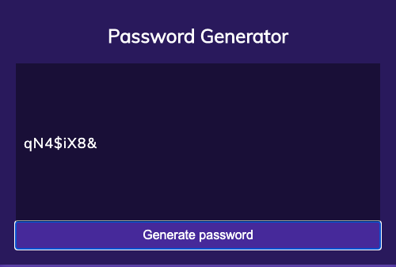

# Password Generator

## Project Description

Main Objective of the project is to build a Password Generator that prompts the user for various inputs and generates a random password that meets OWASP requirements. 

    -   Prompt user for password length between 8-128 characters
    -   Prompt user for lowercase, uppercase, numeric and or special characters
    -   At least one character type should be selected

## Tasks Completed

Following tasks were completed as per requirements, screenshot of main page and link are included

    -   Built Password Generator as per above requirements using JS, html & CSS
    -   password length between 8-128 characters, at-least one character type    

Link - [Password Generator](https://arorark77.github.io/03-Homework/index.html)

Screenshot - 

## Validation

Verified password generation using various combinations

## Observations and Learning opportunity

This exercise was a bit challenging and provided a great learning opportunity for using JS functions and methods.Also provided an opportunity to work with DOM elements.