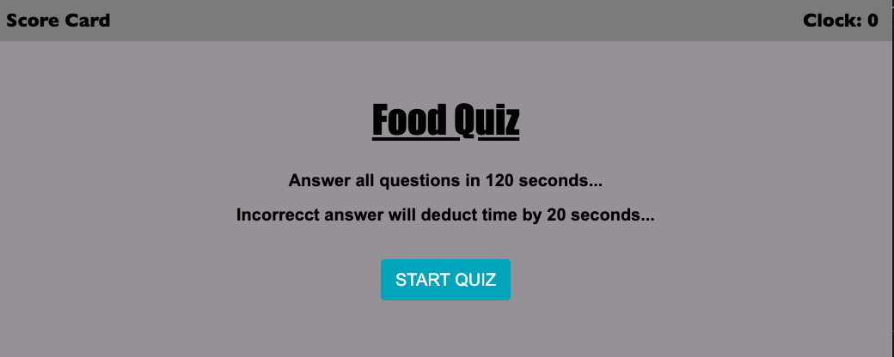
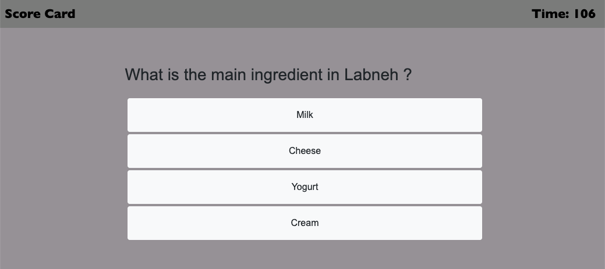

# Timed Quiz

## Assignment

Main Objective of this assignment was to build a times quiz using Javascript. When the quiz starts, a countdown timer starts, for every incorrect answer 20 seconds are deducted from the timer. Person who answers all questions in least amount of time, wins !! 

## Tasks Completed

Following tasks were completed as per assignment requirement, screenshot of few pages and links are included

    -   Built the game app with few sample questions
    -   Built the timer that counts down as game starts
    -   stores the scores of all players, till reset
    -   Capability to list the scores, reset the scores and restart the game
    -   Responsive on different screen sizes   

Link - [Timed Quiz](https://arorark77.github.io/04-Homework/index.html)

Screenshot - 

## Validation

Verified Operation of game by playing it few times and everything seem to be working as expected

## Observations and Learning opportunity

This exercise was quite challenging with set timer and set Interval functions and more moving pieces as compared to other assignments but provided an opportunity to learn and work on slightly more complex app