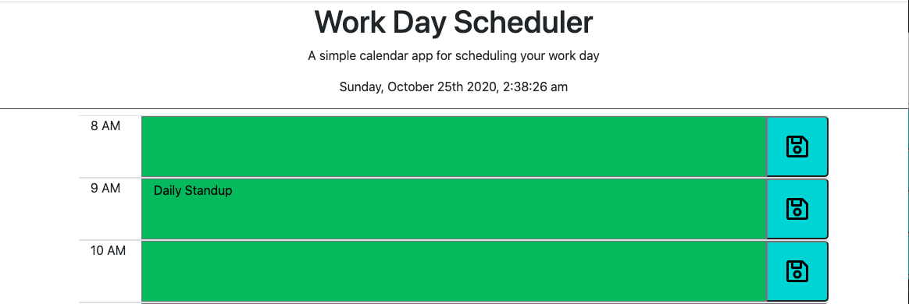
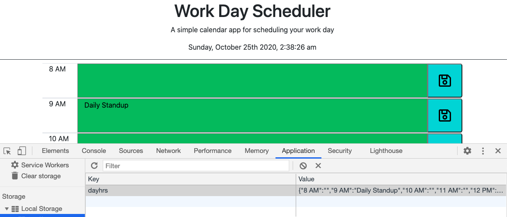

# Work Day Calendar Assignment

## Assignment

Main Objective of this assignment was to build a workday calendar app so that a busy professional can keep track of his/her workday hours. Show the past, present and future hours by different colors. Workday Calendar info should be stored in local storage so that it can be retrieved even if browser is closed. 

## Tasks Completed

Following tasks were completed as per assignment requirement, screenshot of few pages and links are included

    -   Built the calendar app as per requirements
    -   Each hour block changes color based on present, past or future hour
    -   Used moment.js library for timing components
    -   Calendar app contents saved in local storage for retrieval after browser shutdown    

Link - [Calendar App](https://arorark77.github.io/05-Homework/index.html)

Screenshot - 

## Validation

Verified Operation of Calendar App by adding and deleting entries from calendar and verifying in local storage.

## Observations and Learning opportunity

This exercise was a bit challenging with opportunity to learn and get comfortable with jquery and familiarity with local storage and moment.js.