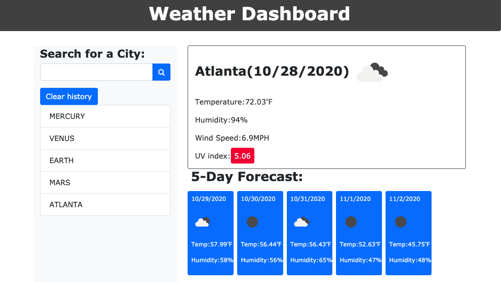
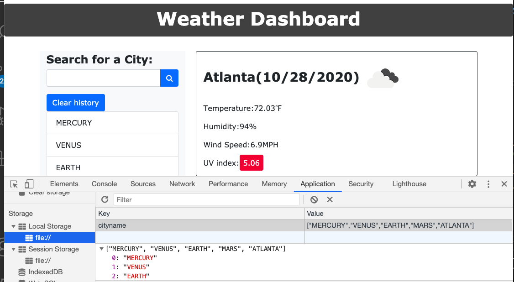

# Weather Dashboard Assignment

## Assignment

Main Objective of this assignment was to build a weather dashboard app so that as a frequent traveller one can keep track of temperature and other weather conditions. User of the app should be able to save the cities searched and can get the current weather and 5 day forecast displayed.

## Tasks Completed

Following tasks were completed as per assignment requirement, screenshot of few pages and links are included

    -   Built the weather app as per requirements
    -   Current city weather conditions displayed and saved in the search
    -   UV index color representation and weather icon representation
    -   5 day forecast of the city selected with weather icons
    -   Search cities history saved in local storage
 

Link - [Weather App](https://arorark77.github.io/06-Homework/index.html)

Screenshot - 

## Validation

Verified Operation of Weather App by adding and clearing different cities and verifying in local storage.

## Observations and Learning opportunity

This exercise was a good learning opportunity to retrieve and parse data from 3rd party APIs and provided the opportunity to learn and get comfortable with API query and response parsing and displaying the results.