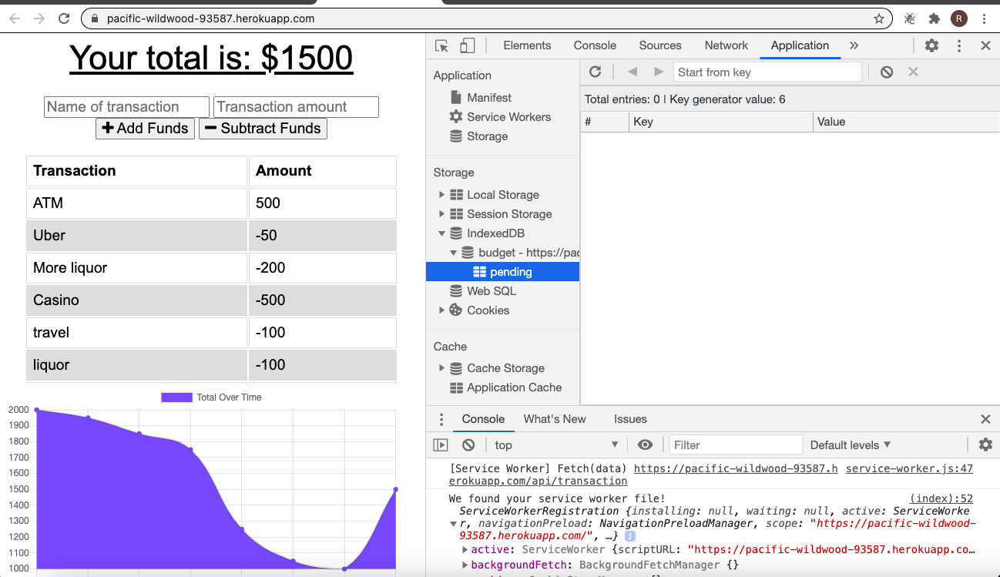
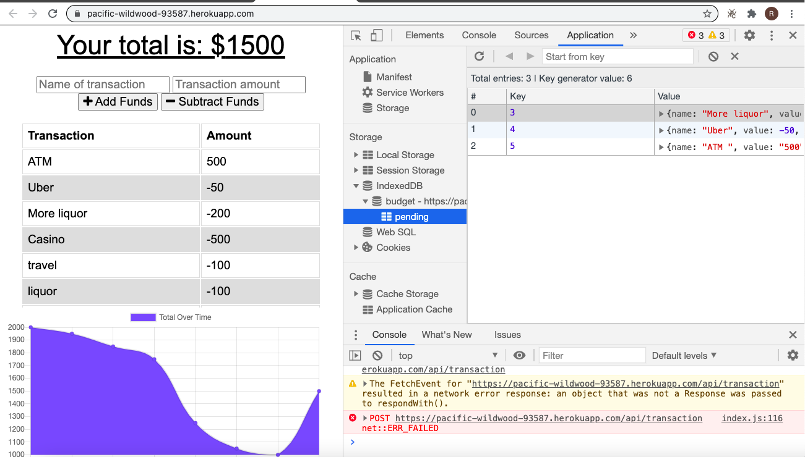

# Budget Tracker App

Budget Tracker App using Progressive Web App Methodologies for online/offline functionality, deployed on Heroku using IndexedDB and MongoDB running on MongoDB Atlas.

Deployed App url - https://pacific-wildwood-93587.herokuapp.com/

## Main App Features

-   Progressive Web App
-   Offline and Online Functionality
-   Offline Data Storage in IndexedDB  

## Usage

### Locally

Make sure MongoDB is running locally, Run below command to start the app server

```
npm install && node server.js
```
Test the App and DB by verifying Documents in DB using mongoDB compass.

### Heroku

-   Deploy the app on Heroku
-   Get Connection String info from MongoDB Atlas to populate Heroku app env variables
-   Update env variables so that app can connect to MongoDB Atlas

## App Pages

### Main App Pages





## Observations and Learning opportunity

This was a good assignment and provided exposure to Progressive Web Apps, Service Workers, IndexedDB, Caching and how to develop & work with progressive web apps.

