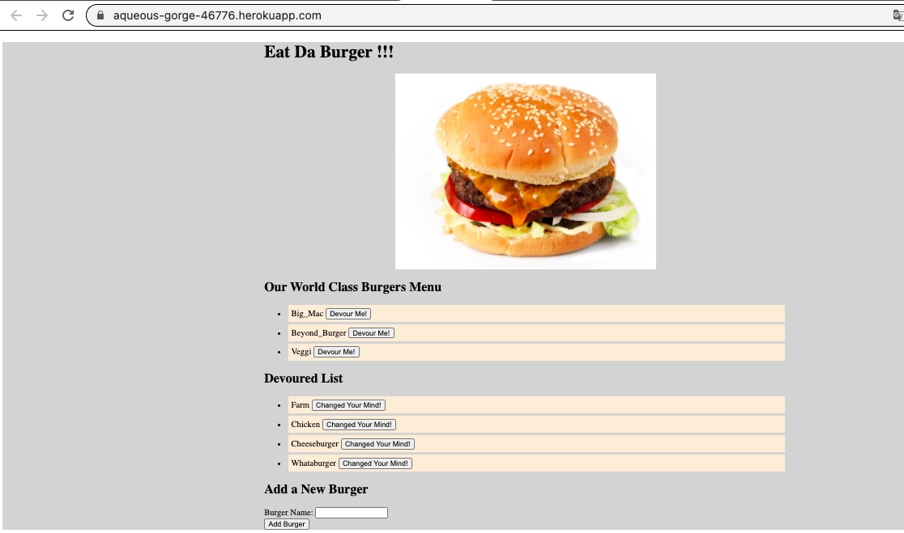

# Eat Da Burger App

Eat the Burger app using Node, Express, Handlebars and MySQL using MVC design principles. App is deployed on Heroku with JAWSDB MySQL Database.

App url - https://aqueous-gorge-46776.herokuapp.com/

## Assignment

Main Objective of this assignment was to build and deploy 'Eat Da Burger' App on Heroku. Cats App discussed in class was a good reference, tested the app locally and then deployed on heroku with JAWSDB MySQL Database.

## Tasks Completed

Following tasks were completed as per assignment requirement, screenshot and links are included

    -   Created MySQL Database locally to test and develop the app
    -   Built the app as per MVC principles
    -   Deployed the App locally for development and testing
    -   Deployed the app on Heroku and tested, verified the functionality    

## Usage

### Locally

-   First Create Database and tables as per schema.sql
-   Upload Sample data using seeds.sql
-   Update DB connection Information with appropriate credentials

Run below commands to start interacting with App

```
npm install express, express-handlebars, mysql
node server.js
```
### Heroku

-   Deploy the app on Heroku
-   Add-on JAWSDB MySQL Database to deployed app 
-   Update connection.js file so that it can use the JAWSDB.

## App Pages

### Main App Page



## Verification

Verified functionality of app by performing tasks on locally deployed app and heroku deployed app

-   Add a Burger
-   Devour a Burger
-   UnDevour a Burger

## Observations and Learning opportunity

This was a challenging assignment and provided some exposure to using handlebars and MVC, Also deploying a MySQL Database on Heroku and interacting with that database was a good learning opportunity.

