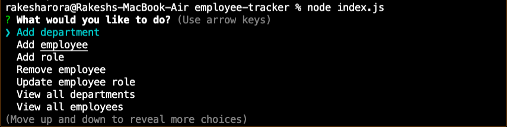

# Employee Tracker CMS

Command Line Application to Manage Employee Data using Node.js, Inquirer and MySQL

## Assignment

Main Objective of this assignment was to build an Employee Tracker application that uses CLI to interact and manage Employee Database.

## Tasks Completed

Following tasks were completed as per assignment requirement, screenshot and links are included

    -   Created MySQL Database and loaded some test data
    -   Created index.js to interact with MySQL database
    -   Used Inquirer for end user interaction with the App
    -   Performed Manual verification by running fe tests

## Usage

First Create Database and tables as per emptrack.sql
upload Sample data, example seed.sql

Run below commands to start interacting with App

```
npm install inquirer, mysql, console.table
node index.js
```
## App Pages

### Main App Page



### Working App gif


## Verification

Verified functionality of app by performing few tests from the CLI

-   View all Employees
-   View all Roles
-   Add an Employee
-   Remove an Employee

## Observations and Learning opportunity

Working with MySQL and using the queries in a real application was a good learning experience, little bit challenge was to write the queries and use them appropriately in the app.

