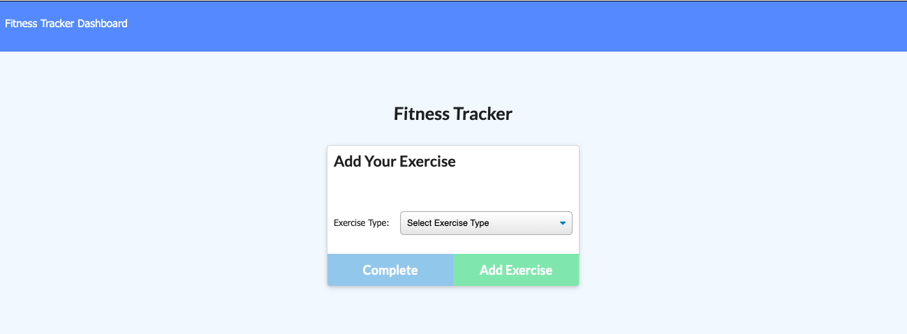
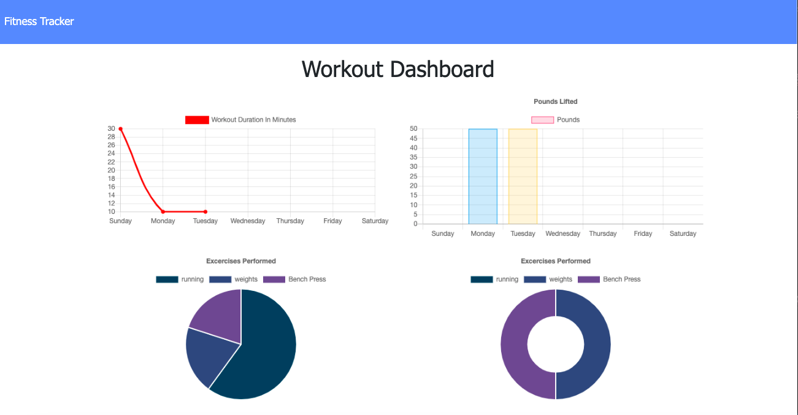

# Fitness Tracker App

Fitness Tracker App using Node, Express, MongoDB, Mongoose and deployed on Heroku using MongoDB running on MongoDB Atlas.

Deployed App url - https://lit-depths-12485.herokuapp.com/

## Assignment

Main Objective of this assignment was to create MongoDB Schema using Mongoose and deploy the app on Heroku with MongoDB Database deployed on MongoDB Atlas.

## Tasks Completed

Following tasks were completed as per assignment requirement, screenshot and links are included

    -   Created MongoDB Schema using Mongoose
    -   Tested the app locally by connecting to local instance of MongoDB
    -   Created DB and Collection on MongoDB Atlas
    -   Deployed the app on Heroku, connected to MongoDB running on MongoDB Atlas    

## Usage

### Locally

Make sure MongoDB is running locally, Run below command to start the app server

```
npm install && node server.js
```
Test the App and DB by verifying Documents in DB using mongoDB compass.

### Heroku

-   Deploy the app on Heroku
-   Get Connection String info from MongoDB Atlas to populate Heroku app env variables
-   Update env variables so that app can connect to MongoDB Atlas

## App Pages

### Main App Page





## Verification

Verified functionality of app by performing tasks on locally deployed app and heroku deployed app

-   Created new Workout
-   Added to Workout
-   Tacked Workout on Dashboard

## Observations and Learning opportunity

This was a good assignment and provided exposure to using MongoDB, Mongoose and MongoDB Atlas.

