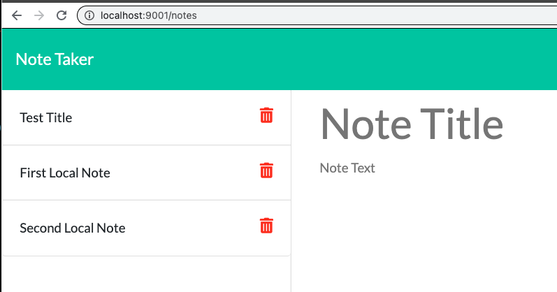
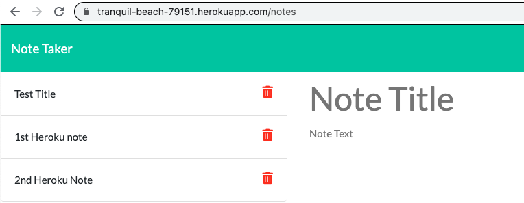

# note-taker App

## Heroku App url:

## https://tranquil-beach-79151.herokuapp.com/

## Assignment
Main Objective of this assignment was to build an express backend with routing to different pages and deploy it locally and to Heroku.

## Tasks Completed

Following tasks were completed as per assignment requirement, screenshot and links are included

    -   Built the app backend using express and performed routing to provided frontend code
    -   Deployed and tested the app locally
    -   Deployed and tested the app on Heroku 

## Usage

Locally
```
npm install
node server.js
```
## App Pages

### Main App Page - Local Deployment



### db file - Local Deployment


### Main App Page - Heroku Deployment




## Observations and Learning opportunity

Deployment to Heroku was a bit challenging and interesting and provided the opportunity to learn and work on express backend and Heroku Deployment

