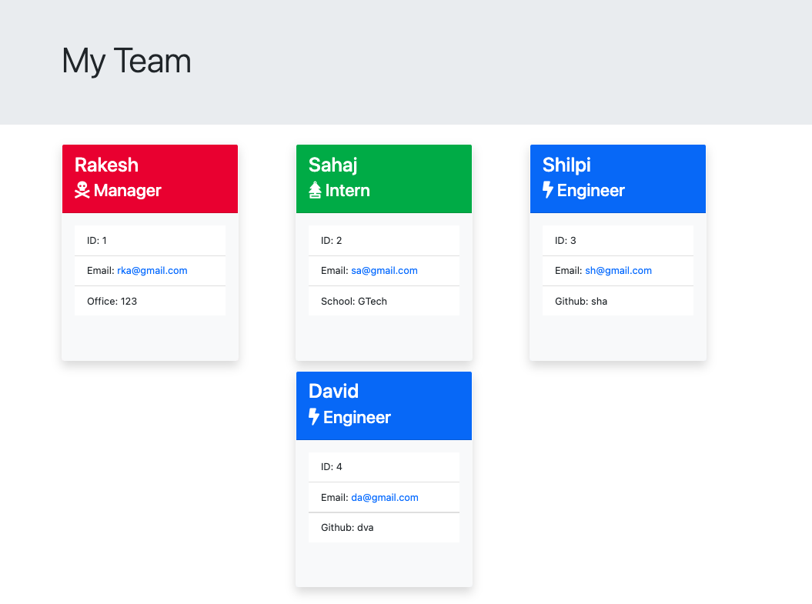
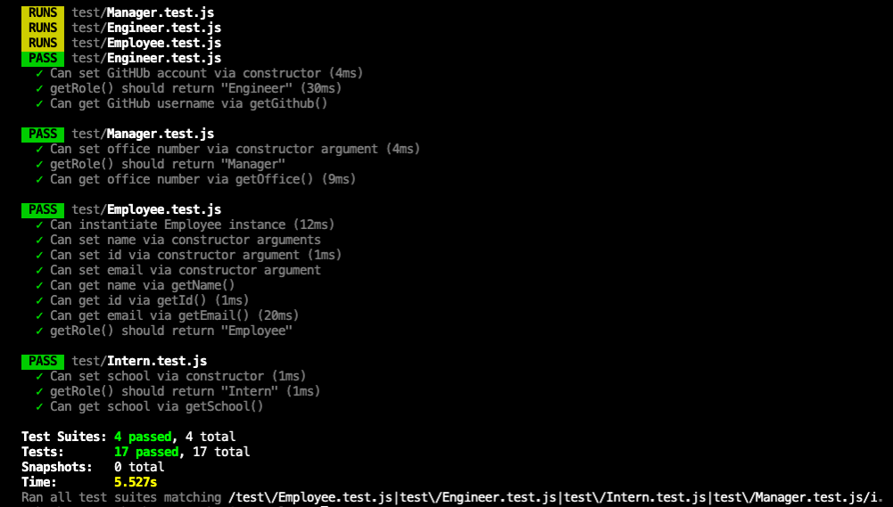

# Template-Engine-Employee-Summary

## Assignment

Main Objective of this assignment was to build a node CLI app that takes input about the team members and generates an html page with team info including Manager, Employees and Intern. Information should be collected in CLI prompts.

## Tasks Completed

Following tasks were completed as per assignment requirement, screenshot of few pages and links are included

    -   Built the node CLI app that prompts for employee inputs
    -   Employee inputs about Manager, Engineer and Intern
    -   Created html files for Manager, Engineer and Intern
    -   Created test cases and ran tests  

## Usage

```
node app.js
```
## Running Tests

```
npm run test
```
## Team Page



## Tests



## Validation

Verified Operation of CLI App by creating few dummy teams also ran all the tests in test suites

## Observations and Learning opportunity

This exercise was a good learning opportunity to work with node.js app and using test suites to perform various tests on the application code.